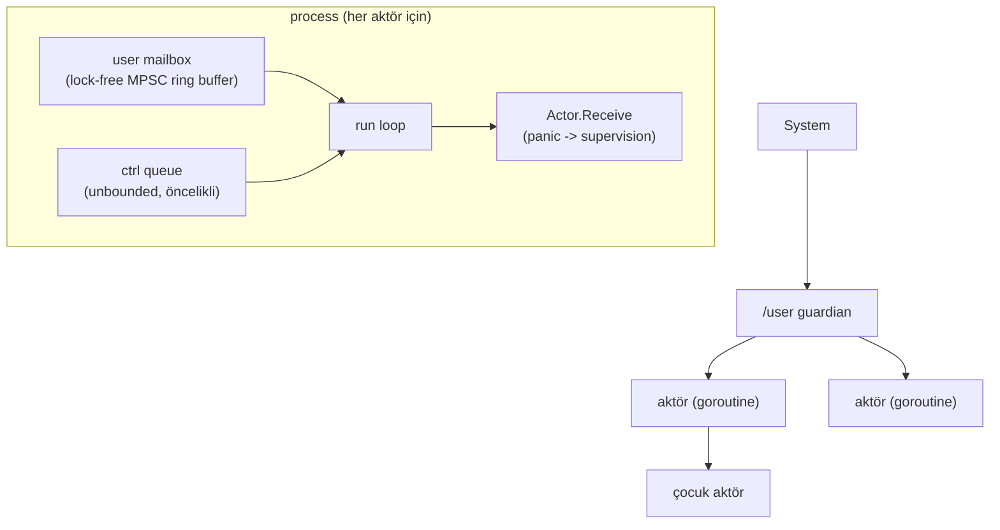
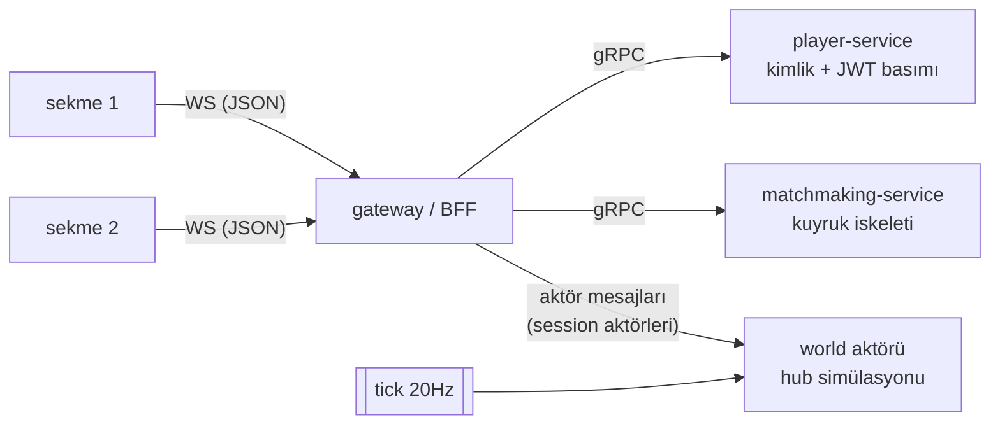
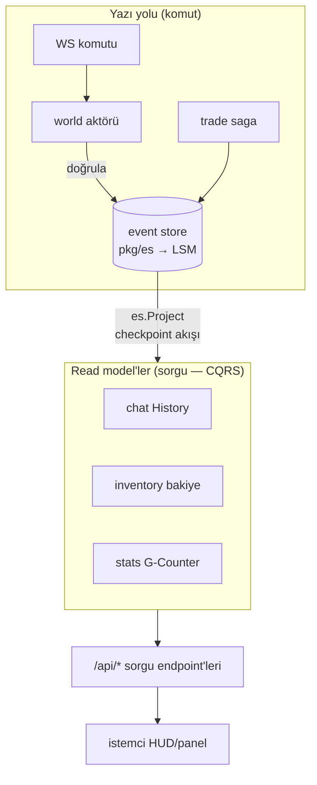

# Shardlands

2D top-down mini-MMO: kalıcı, shard'lanmış bir hub dünyası + talep üzerine
açılan gerçek zamanlı arena instance'ları. Amaç, dağıtık sistem
konseptlerini (konsensüs, event sourcing, sharding, actor model, CRDT,
observability...) üretim kalitesinde ama öğrenme odaklı bir projede uçtan
uca uygulamak.

## Monorepo Yapısı

```
pkg/actor/     Faz 0: sıfırdan actor framework (mailbox, supervision)  ✅
pkg/ringbuf/   Faz 0: lock-free MPSC ring buffer                       ✅
pkg/storage/   Faz 0: LSM-tree storage engine                          ✅
pkg/raft/      Faz 0: Raft konsensüs                                   ✅
pkg/clock/     Faz 0: Lamport / vector clock                           ✅
pkg/auth/      Faz 1: minimal HS256 JWT (stdlib)                       ✅
pkg/es/        Faz 2: event store (LSM üstünde, CQRS/ES)               ✅
pkg/crdt/      Faz 2: G/PN-Counter CRDT                                ✅
pkg/hashring/  Faz 3: consistent hashing (vnode'lu)                    ✅
proto/         Faz 1: gRPC/Protobuf kontratları (buf ile codegen)      ✅
gen/           Üretilen Go kodu (commit'li — araçsız build için)       ✅
services/      Faz 1+: gateway, player, world, matchmaking, server     ✅
operator/      Faz 5: arena instance Kubernetes operator'ü             ⬜
client/        HTML5 Canvas + vanilla JS istemci                       ✅
```

## Faz 0 — Temel Yapı Taşları ✅ (tag: `faz0`)

| Bileşen | Durum | Notlar |
|---|---|---|
| Actor framework | ✅ | [pkg/actor](pkg/actor/README.md) — mailbox, supervision, restart stratejileri |
| Lock-free ring buffer | ✅ | [pkg/ringbuf](pkg/ringbuf/README.md) — Vyukov MPSC, mailbox'a entegre, kanaldan ~6× hızlı |
| LSM-tree storage engine | ✅ | [pkg/storage](pkg/storage/README.md) — skip list memtable, SSTable+bloom, WAL, manifest, compaction |
| Raft | ✅ | [pkg/raft](pkg/raft/README.md) — leader election + log replication, partition/chaos testleri |
| Logical clocks | ✅ | [pkg/clock](pkg/clock/README.md) — Lamport (atomic) + vector clock (nedensellik/eşzamanlılık) |

### Faz 0 kapanış — öne çıkan dersler

Ayrıntılar paket README'lerinde; kesitler:

1. **Sınır durumları tasarımın parçası.** Ring buffer'da cap-1 seq
   çakışması canlı deadlock olarak yakalandı; invariant yazıya dökülünce
   asgari kapasite kendiliğinden çıktı.
2. **Doğruluk çoğu kez sıralamada yaşıyor.** Aktör kapanışında
   dead→drain→close; LSM'de WAL→memtable, fsync→manifest; Raft'ta
   persist→cevap. Her biri "arada crash olursa?" sorusuyla test edildi.
3. **Flaky test hediyedir.** Üç gerçek hata (actor kapanış yarışı,
   cap-1, Windows delete-pending) önce test kararsızlığı olarak göründü.
4. **Bölünme birinci sınıf senaryodur.** Raft'ta partition, transport
   arayüzüne gömüldü; bütün ilginç davranışlar bölünmede yaşanıyor.
5. **Platform semantiği taşınabilir değil.** Windows'ta açık/yeni
   kapanmış dosya silme kısıtları iki gerçek düzeltme çıkardı
   (O_TRUNC'lı WAL reset, kapatmadan silmeme disiplini).

### Actor framework mimarisi



## Faz 1 — Çekirdek İskelet, Tek Node (devam ediyor)

Monolit prototip: tüm servisler TEK süreçte ama GERÇEK ağ sınırlarıyla
(player/matchmaking ayrı TCP portlarında gRPC, gateway gerçek gRPC
istemcisi). Faz 4'teki strangler-fig anlatısının "önce" hali.



- **Kimlik:** `POST /api/login` → player-service oyuncu yaratır, HS256
  JWT basar ([pkg/auth](pkg/auth/jwt.go)); gateway WS el sıkışmasında doğrular.
- **Session'lar:** her WS bağlantısı bir aktör; WS yazmaları aktör
  goroutine'inden (gorilla "tek yazar" kuralı bedavaya), yavaş istemcide
  kare düşer (DropNewest) — dünya asla beklemez.
- **Hareket:** sunucu-otoriter; istemci yalnızca basılı tuş durumunu
  gönderir, dünya 20Hz tick'te fiziği işler ve tam snapshot yayınlar
  (delta/AOI Faz 5).
- **E2E dilim:** "iki sekme birbirinin hareketini görür" hem otomatik
  testte ([server_test.go](services/server/server_test.go)) hem canlı
  tarayıcıda doğrulandı.

## Faz 2 — Kalıcı Hub ve Veri Modeli (devam ediyor)

| Parça | Durum | Notlar |
|---|---|---|
| Event store | ✅ | [pkg/es](pkg/es/README.md) — pkg/storage üstünde; atomik batch, optimistic concurrency, subscribe |
| Chat dilimi (CQRS/ES) | ✅ | komut → world aktörü → ChatSaid event → balon + [read model](services/chat/history.go) + `/api/chat/recent`; restart'ta geçmiş kalıcı |
| Kaynak toplama + envanter | ✅ | respawn'lı node'lar, `ResourceGathered` → `inv-<player>` stream'i → [envanter read model](services/inventory/inventory.go) + `/api/inventory` |
| Trade saga | ✅ | [services/trade](services/trade/README.md) — koreografi + orkestrasyon; rezervasyon, telafi, idempotentlik; `/api/trade` |
| CRDT global sayaçlar | ✅ | [pkg/crdt](pkg/crdt/README.md) — G/PN-Counter, merge özellikleri testli; [services/stats](services/stats/stats.go) toplam toplanan (G-Counter) + `/api/stats` |

### Faz 2 mimarisi (CQRS + Event Sourcing)



Yazı ve okuma tamamen ayrı; ikisini yalnız event log bağlar. Read
model'ler her açılışta log'dan sıfırdan kurulur.

### Faz 2 kapanış — dersler

- **Türetilemeyeni persist et.** Event log tek gerçek; read model'ler,
  es indeksi, CRDT sayaçları hep türetilebilir → persist edilmez, replay
  ile kurulur. (LSM'deki MANIFEST tersi: dosya listesi türetilemez.)
- **Idempotentlik, event dünyasının vergisi.** At-least-once teslim +
  restart replay = her şey tekrar-güvenli olmalı: es batch (tek anahtar),
  saga adımları (tradeID key), read model'ler (0'dan replay).
- **Doğru veri tipi protokolü kaldırır.** Takas Raft-vari koordinasyon
  ister (saga); toplam sayaç CRDT ile lidersiz yakınsar. Problemi araca
  göre değil, aracı probleme göre seç.
- **Dürüst dual-write borcu.** Chat balonu (dünya durumu) + ChatSaid
  (log) iki yazma; süreç içi tek yazarla risk düşük, gerçek çözüm
  (outbox/bus) Faz 4'e yazıldı — gizlenmedi.
- **MVCC'nin event-store hâli.** Event'ler değişmez olduğundan bir
  okuyucunun gördüğü [1..checkpoint] sonsuza dek sabit; versiyon = log
  pozisyonu. Genel amaçlı snapshot isolation (Scan hâlâ kilitli) Faz 3.

## Çalıştırma

```powershell
go run ./cmd/server        # http://localhost:8080 — iki sekme aç
go test -race ./...        # tüm testler
```

Proto codegen (kontrat değişince): `buf generate` — araçlar:
`go install github.com/bufbuild/buf/cmd/buf@latest`,
`google.golang.org/protobuf/cmd/protoc-gen-go@latest`,
`google.golang.org/grpc/cmd/protoc-gen-go-grpc@latest`.
Üretilen kod `gen/` altında commit'lidir (araçsız `go build` çalışsın diye).
