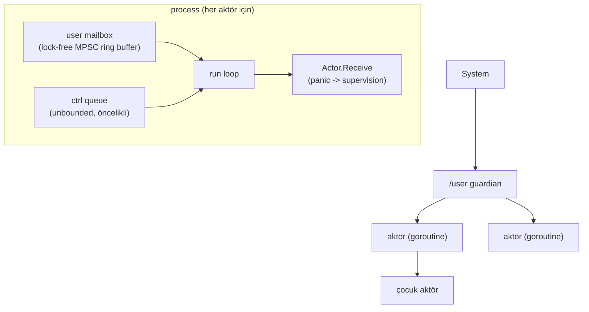
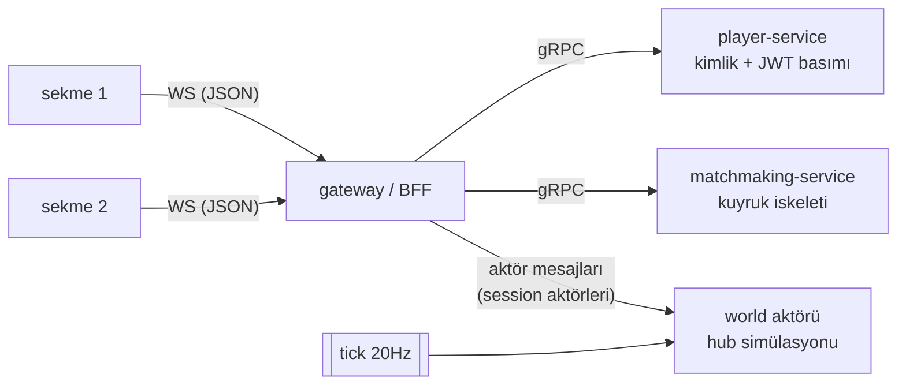
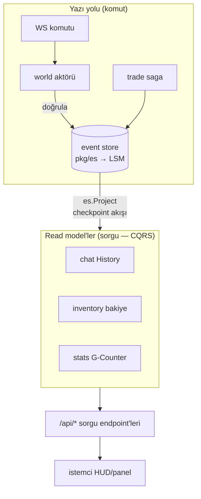
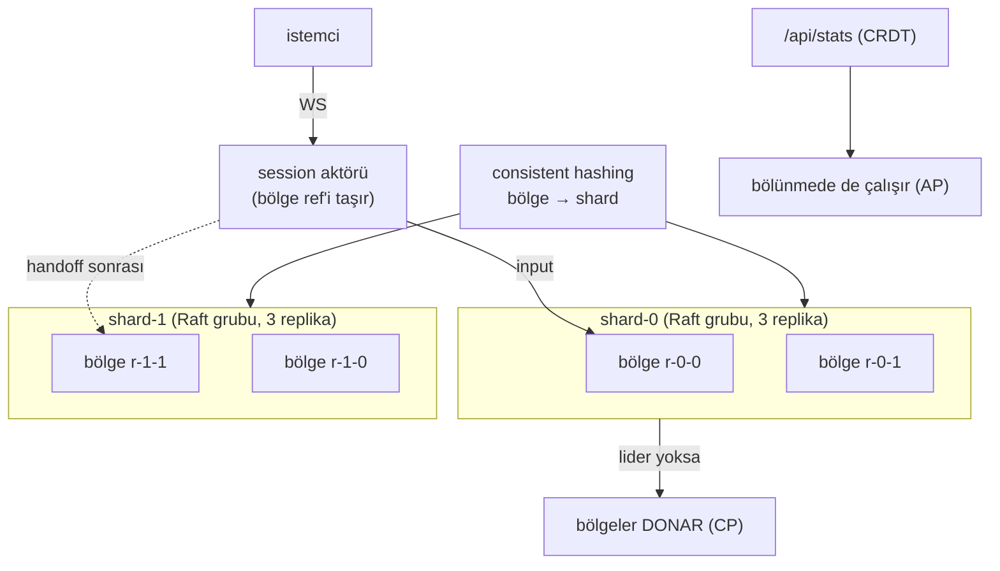
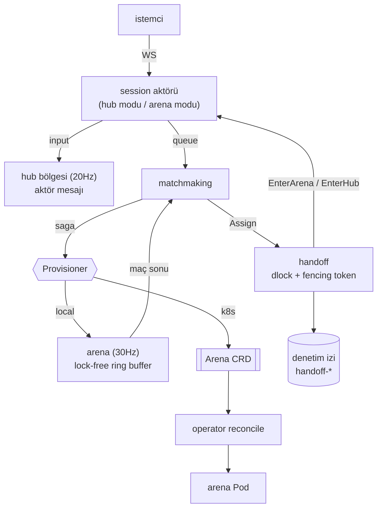
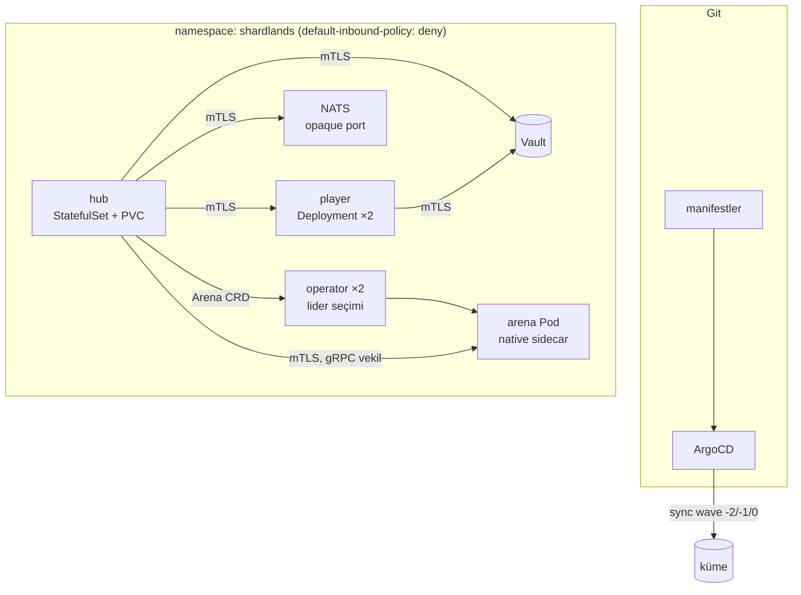
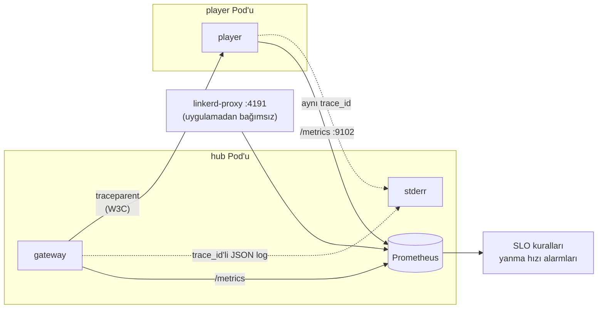

# Shardlands

2D top-down mini-MMO: kalıcı, shard'lanmış bir hub dünyası + talep üzerine
açılan gerçek zamanlı arena instance'ları. Amaç, dağıtık sistem
konseptlerini (konsensüs, event sourcing, sharding, actor model, CRDT,
observability...) üretim kalitesinde ama öğrenme odaklı bir projede uçtan
uca uygulamak.

**Sekiz faz tamamlandı** (`faz0` … `faz7`). Faz 0'ın bütün altyapısı —
aktör sistemi, lock-free ring buffer, LSM-tree, Raft, CRDT, consistent
hashing, dağıtık kilit — **kütüphanesiz, sıfırdan** yazıldı; amaç en hızlı
çözümü bulmak değil mekanizmayı anlamaktı.

> 📖 **[LEARNINGS.md](LEARNINGS.md)** — sekiz faz boyunca tekrar eden 12
> ders. Fazların özeti değil; aynı ilkenin farklı katmanlarda nasıl
> tekrar tekrar karşımıza çıktığının derlemesi. Projeyle ilgili tek bir
> şey okunacaksa o olmalı.

## Bir bakışta

| | |
| --- | --- |
| **İki farklı gecikme profili** | Hub tutarlılık öncelikli (20 Hz, event-sourced, bölünmede **donar**); arena gecikme öncelikli (30 Hz, lock-free, aşırı yükte **komut düşürür**) |
| **Sıfırdan yazılanlar** | aktör sistemi, MPSC ring buffer, LSM+WAL, Raft, vector clock, CRDT, consistent hashing, dlock, event store, JWT, W3C trace context, Vault istemcisi |
| **Platform** | Kubernetes, Linkerd (mTLS + zero trust), ArgoCD (GitOps), Vault, Prometheus |
| **Doğrulama** | 46 test dosyası, 6 kaos deneyi, kümede uçtan uca duman testi |
| **Ölçek** | ~21.000 satır Go, 10 kavram notu |

### Öne çıkan ölçümler

```
false sharing etkisi (8 çekirdek)     16.05 → 1.25 ns/op   (12.8×)
arena tick                            39.8 ns
hub world tick p95 (kümede)           47.5 µs    (bütçe 50 ms)
gRPC sunucu p95 vs istemci p95        475 µs vs 7750 µs  ← fark: ağ + mesh
WS vs QUIC datagram p99 (%10 kayıp)   150 ms vs ≈0
kesintisiz dağıtım (player / hub)     0 hata / ~4 sn
anahtar rotasyonu                     eski token geçerli kalır, restart yok
```

## Monorepo Yapısı

```
pkg/actor/     Faz 0: sıfırdan actor framework (mailbox, supervision)  ✅
pkg/ringbuf/   Faz 0: lock-free MPSC ring buffer                       ✅
pkg/storage/   Faz 0: LSM-tree storage engine                          ✅
pkg/raft/      Faz 0: Raft konsensüs                                   ✅
pkg/clock/     Faz 0: Lamport / vector clock                           ✅
pkg/auth/      Faz 1: minimal HS256 JWT (stdlib)                       ✅
pkg/es/        Faz 2: event store (LSM üstünde, CQRS/ES)               ✅
pkg/crdt/      Faz 2: G/PN-Counter CRDT                                ✅
pkg/hashring/  Faz 3: consistent hashing (vnode'lu)                    ✅
pkg/raftstore/ Faz 3: Raft Storage'ın LSM tabanlı kalıcı hâli          ✅
pkg/dlock/     Faz 3: Raft üstünde lease+fencing dağıtık kilit         ✅
pkg/bus/       Faz 4: event bus (NATS JetStream) + DLQ/backpressure    ✅
pkg/resilience/Faz 4: circuit breaker + bulkhead                       ✅
pkg/ratelimit/ Faz 4: token bucket (rate limit / load shedding)        ✅
proto/         Faz 1: gRPC/Protobuf kontratları (buf ile codegen)      ✅
gen/           Üretilen Go kodu (commit'li — araçsız build için)       ✅
services/      Faz 1+: gateway, player, world, matchmaking, server     ✅
services/arena Faz 5: geçici dövüş instance'ları (lock-free tick)      ✅
services/handoff Faz 5: hub↔arena transferi (dlock + fencing)          ✅
operator/      Faz 5: arena instance Kubernetes operator'ü (CRD)       ✅
experiments/   Faz 5: taşıma karşılaştırması (WS vs QUIC)              ✅
client/        HTML5 Canvas + vanilla JS istemci                       ✅
pkg/vault/     Faz 6: sır sıfırı + KV okuma (elle yazılmış istemci)  ✅
pkg/metrics/   Faz 7: Prometheus metrikleri (RED/USE, kardinalite)      ✅
pkg/trace/     Faz 7: W3C Trace Context (sıfırdan)                     ✅
pkg/logging/   Faz 7: slog + otomatik trace korelasyonu                 ✅
deploy/        Faz 6: Docker, K8s, mesh, GitOps, Vault, kaos            ✅
```

## Kavram notları

Her biri koda geçmeden önce yazılmış "neden böyle" belgeleri:

| Not | Konu |
| --- | --- |
| [cap-pacelc.md](docs/cap-pacelc.md) | CAP/PACELC ve bu projenin profili (PC/EL) |
| [2pc-vs-saga.md](docs/2pc-vs-saga.md) | Dağıtık işlem yerine telafi |
| [strangler-fig.md](docs/strangler-fig.md) | Monolitten servislere kademeli geçiş |
| [ws-vs-quic.md](docs/ws-vs-quic.md) | Head-of-line blocking, ölçümle |
| [service-mesh.md](docs/service-mesh.md) | Sidecar, mTLS, zero trust + 5 tuzak |
| [zero-downtime.md](docs/zero-downtime.md) | Kesintisiz dağıtım zinciri ve nerede kopar |
| [gitops.md](docs/gitops.md) | Pull vs push, ArgoCD = bir üst reconcile |
| [secrets.md](docs/secrets.md) | Sır sıfırı, rotasyon, K8s Secret neden sır değil |
| [chaos.md](docs/chaos.md) | Hipotezi önce yaz |
| [observability.md](docs/observability.md) | Üç sinyal, SLO, yanma hızı alarmları |

## Faz 0 — Temel Yapı Taşları ✅ (tag: `faz0`)

| Bileşen | Durum | Notlar |
|---|---|---|
| Actor framework | ✅ | [pkg/actor](pkg/actor/README.md) — mailbox, supervision, restart stratejileri |
| Lock-free ring buffer | ✅ | [pkg/ringbuf](pkg/ringbuf/README.md) — Vyukov MPSC, mailbox'a entegre, kanaldan ~6× hızlı |
| LSM-tree storage engine | ✅ | [pkg/storage](pkg/storage/README.md) — skip list memtable, SSTable+bloom, WAL, manifest, compaction |
| Raft | ✅ | [pkg/raft](pkg/raft/README.md) — leader election + log replication, partition/chaos testleri |
| Logical clocks | ✅ | [pkg/clock](pkg/clock/README.md) — Lamport (atomic) + vector clock (nedensellik/eşzamanlılık) |

### Faz 0 kapanış — öne çıkan dersler

Ayrıntılar paket README'lerinde; kesitler:

1. **Sınır durumları tasarımın parçası.** Ring buffer'da cap-1 seq
   çakışması canlı deadlock olarak yakalandı; invariant yazıya dökülünce
   asgari kapasite kendiliğinden çıktı.
2. **Doğruluk çoğu kez sıralamada yaşıyor.** Aktör kapanışında
   dead→drain→close; LSM'de WAL→memtable, fsync→manifest; Raft'ta
   persist→cevap. Her biri "arada crash olursa?" sorusuyla test edildi.
3. **Flaky test hediyedir.** Üç gerçek hata (actor kapanış yarışı,
   cap-1, Windows delete-pending) önce test kararsızlığı olarak göründü.
4. **Bölünme birinci sınıf senaryodur.** Raft'ta partition, transport
   arayüzüne gömüldü; bütün ilginç davranışlar bölünmede yaşanıyor.
5. **Platform semantiği taşınabilir değil.** Windows'ta açık/yeni
   kapanmış dosya silme kısıtları iki gerçek düzeltme çıkardı
   (O_TRUNC'lı WAL reset, kapatmadan silmeme disiplini).

### Actor framework mimarisi



## Faz 1 — Çekirdek İskelet, Tek Node ✅ (tag: `faz1`)

Monolit prototip: tüm servisler TEK süreçte ama GERÇEK ağ sınırlarıyla
(player/matchmaking ayrı TCP portlarında gRPC, gateway gerçek gRPC
istemcisi). Faz 4'teki strangler-fig anlatısının "önce" hali.



- **Kimlik:** `POST /api/login` → player-service oyuncu yaratır, HS256
  JWT basar ([pkg/auth](pkg/auth/jwt.go)); gateway WS el sıkışmasında doğrular.
- **Session'lar:** her WS bağlantısı bir aktör; WS yazmaları aktör
  goroutine'inden (gorilla "tek yazar" kuralı bedavaya), yavaş istemcide
  kare düşer (DropNewest) — dünya asla beklemez.
- **Hareket:** sunucu-otoriter; istemci yalnızca basılı tuş durumunu
  gönderir, dünya 20Hz tick'te fiziği işler ve tam snapshot yayınlar
  (delta/AOI Faz 5).
- **E2E dilim:** "iki sekme birbirinin hareketini görür" hem otomatik
  testte ([server_test.go](services/server/server_test.go)) hem canlı
  tarayıcıda doğrulandı.

## Faz 2 — Kalıcı Hub ve Veri Modeli ✅ (tag: `faz2`)

| Parça | Durum | Notlar |
|---|---|---|
| Event store | ✅ | [pkg/es](pkg/es/README.md) — pkg/storage üstünde; atomik batch, optimistic concurrency, subscribe |
| Chat dilimi (CQRS/ES) | ✅ | komut → world aktörü → ChatSaid event → balon + [read model](services/chat/history.go) + `/api/chat/recent`; restart'ta geçmiş kalıcı |
| Kaynak toplama + envanter | ✅ | respawn'lı node'lar, `ResourceGathered` → `inv-<player>` stream'i → [envanter read model](services/inventory/inventory.go) + `/api/inventory` |
| Trade saga | ✅ | [services/trade](services/trade/README.md) — koreografi + orkestrasyon; rezervasyon, telafi, idempotentlik; `/api/trade` |
| CRDT global sayaçlar | ✅ | [pkg/crdt](pkg/crdt/README.md) — G/PN-Counter, merge özellikleri testli; [services/stats](services/stats/stats.go) toplam toplanan (G-Counter) + `/api/stats` |

### Faz 2 mimarisi (CQRS + Event Sourcing)



Yazı ve okuma tamamen ayrı; ikisini yalnız event log bağlar. Read
model'ler her açılışta log'dan sıfırdan kurulur.

### Faz 2 kapanış — dersler

- **Türetilemeyeni persist et.** Event log tek gerçek; read model'ler,
  es indeksi, CRDT sayaçları hep türetilebilir → persist edilmez, replay
  ile kurulur. (LSM'deki MANIFEST tersi: dosya listesi türetilemez.)
- **Idempotentlik, event dünyasının vergisi.** At-least-once teslim +
  restart replay = her şey tekrar-güvenli olmalı: es batch (tek anahtar),
  saga adımları (tradeID key), read model'ler (0'dan replay).
- **Doğru veri tipi protokolü kaldırır.** Takas Raft-vari koordinasyon
  ister (saga); toplam sayaç CRDT ile lidersiz yakınsar. Problemi araca
  göre değil, aracı probleme göre seç.
- **Dürüst dual-write borcu.** Chat balonu (dünya durumu) + ChatSaid
  (log) iki yazma; süreç içi tek yazarla risk düşük, gerçek çözüm
  (outbox/bus) Faz 4'e yazıldı — gizlenmedi.
- **MVCC'nin event-store hâli.** Event'ler değişmez olduğundan bir
  okuyucunun gördüğü [1..checkpoint] sonsuza dek sabit; versiyon = log
  pozisyonu. Genel amaçlı snapshot isolation (Scan hâlâ kilitli) Faz 3.

## Faz 3 — Sharding ve Dağıtım ✅ (tag: `faz3`)

| Parça | Notlar |
|---|---|
| Consistent hashing | [pkg/hashring](pkg/hashring/README.md) — vnode'lu halka; minimal remap testli |
| Bölge-shard'lı dünya | 2×2 grid bölge aktörleri; bölge→shard eşlemesi; sınırda **handoff** |
| Shard lideri = Raft | [services/shard](services/shard/shard.go) — shard başına Raft grubu; liderlik sahiplik demek |
| Kalıcı Raft depo | [pkg/raftstore](pkg/raftstore/store.go) — Faz 0 Raft + Faz 0 LSM birleşimi |
| Distributed lock | [pkg/dlock](pkg/dlock/README.md) — lease + **fencing token** |
| CAP/PACELC deneyi | [docs/cap-pacelc.md](docs/cap-pacelc.md) — bilinçli izolasyon |
| 2PC/3PC vs saga | [docs/2pc-vs-saga.md](docs/2pc-vs-saga.md) |



### Faz 3 kapanış — dersler

- **Consistent hashing "minimal" der, "sıfır" demez.** Ekleme yine ~1/N
  anahtar taşır; sıfır taşınma açık atama tablosu (yani merkezi state =
  konsensüs) ister. Biz ikisini birleştirdik: ring hızlı varsayılan
  eşleme, Raft otoriter sahiplik.
- **"Lider sanıyorum" ≠ "hizmet verebiliyorum".** Bölünmüş lider commit
  edemez ama kendini lider sanar; `QuorumActive` (lease) olmadan
  kullanılabilirlik ölçümü yalan söyler. Bu, CAP deneyinin ön koşuluydu.
- **Yeni lider no-op yazmalı.** §5.4.2 gereği lider yalnız kendi
  döneminden bir kaydı commit edebilir; no-op olmadan önceki dönemin
  kayıtları uygulanmaz ve lider onları **okuyamaz** (dlock'ta "kilit
  kayboldu" olarak patladı).
- **Lease tek başına yetmez, fencing token gerekir.** Duraklamış bir
  sahip lease'i dolduktan sonra hâlâ yazmaya çalışabilir; korunan kaynak
  eski token'ı reddetmeli.
- **CAP bir anahtar değil bütçedir.** Aynı sistemde bölge simülasyonu CP
  (donar), global sayaç AP (çalışır). PACELC profilimiz **PC/EL**:
  bölünmede tutarlılık, normalde gecikme.
- **Sharding = ölçek + arıza yalıtımı.** Bir shard'ın izolasyonu
  diğerinin bölgelerini etkilemiyor; blast radius sınırlı.

## Faz 4 — Mesajlaşma ve Dayanıklılık ✅ (tag: `faz4`)

| Parça | Notlar |
|---|---|
| Event bus | [pkg/bus](pkg/bus/bus.go) — NATS JetStream; ack/nak, yeniden teslim, **DLQ**, MaxInFlight ile backpressure |
| Outbox relay | [services/outbox](services/outbox/outbox.go) — dual-write borcu kapandı; store tek yazma yeri, relay bus'a taşır |
| Idempotency | [outbox.Consume](services/outbox/consume.go) — global sıra ile dedupe; at-least-once'ın karşılığı |
| Circuit breaker + bulkhead | [pkg/resilience](pkg/resilience/breaker.go) — kaskad arıza gateway sınırında kesilir |
| Rate limit / load shedding | [pkg/ratelimit](pkg/ratelimit/ratelimit.go) — token bucket; IP başına giriş, bağlantı başına komut |
| Strangler fig | [docs/strangler-fig.md](docs/strangler-fig.md) — Faz 1'den bugüne önce/sonra |

### Faz 4 kapanış — dersler

- **Exactly-once teslim yoktur; idempotent tüketici vardır.** Bus
  at-least-once verir; doğruluk, tüketicinin global sıra ile dedupe
  etmesinden gelir. Yayın tarafı dedupe (Msg-Id) tekrarları *azaltır*,
  garanti etmez.
- **Outbox, dual-write'ın tek dürüst çözümü.** "Hem yaz hem yayınla"
  iki sistem arasında atomiklik ister — yoktur. Tek yere yazıp
  ayrı bir relay ile taşımak, kaybı gecikmeye çevirir.
- **Zehirli mesaj akışı tıkamamalı.** MaxDeliver tükenince mesajı DLQ'ya
  *taşımak* gerekir; JetStream'in max-deliver aşımı mesajı sessizce
  düşürür — bir yere koymaz. Kararı kendimiz veriyoruz.
- **In-memory read model = geçici tüketici.** Kalıcı tüketici kaldığı
  yerden devam eder ve süreç yeniden başlayınca geçmiş kaybolur; akışı
  baştan oynatan geçici tüketici doğrusudur.
- **Bulkhead dışta, breaker içte.** Yük atmadan doğan hatalar
  (ErrFull) bizim doymuşluğumuzdur; devre kesiciye yedirilirse sağlıklı
  bir bağımlılık cezalandırılır. Aynı sebeple **istemci hataları**
  (geçersiz girdi) devreyi açmamalı.
- **Yük atmak bir hizmettir.** Hepsini kabul edip topluca çökmektense
  fazlasını hızlıca reddetmek; `Retry-After` ile istemciye ne yapacağını
  söylemek.

## Faz 5 — Anlık Arenalar ve Gerçek Zamanlılık ✅ (tag: `faz5`)

| Parça | Notlar |
|---|---|
| Arena instance | [services/arena](services/arena/README.md) — 30Hz, lock-free girdi kuyruğu, false sharing benchmark'ı (**12.8×**) |
| Matchmaking saga | [saga.go](services/matchmaking/saga.go) — provision + atama atomikliği, telafileriyle |
| Hub↔arena handoff | [services/handoff](services/handoff/handoff.go) — dlock + **fencing token** + denetim izi |
| K8s Operator | [operator/](operator/README.md) — Arena CRD + idempotent reconcile döngüsü |
| WS vs QUIC | [docs/ws-vs-quic.md](docs/ws-vs-quic.md) — head-of-line blocking ölçümü |



### Faz 5 kapanış — dersler

- **Aynı platformda iki gecikme profili.** Hub tutarlılık öncelikli
  (aktör mesajı, 20Hz, kalıcı log); arena gecikme öncelikli (lock-free
  ring buffer, 30Hz, geçici durum, aşırı yükte komut düşür). Projenin
  ana tezi burada somutlaştı.
- **False sharing ölçek büyüdükçe büyür.** Faz 0'da %24 olan etki,
  çekişme 8 çekirdeğe yayılınca **12.8×**'e çıktı. Paylaşmadığını
  sandığın şeyi donanım paylaşıyor olabilir.
- **Kilit semantiği ≠ kullanım niyeti.** `dlock` aynı sahibin yeniden
  almasını idempotent kabul eder (doğru davranış); ama biz iki *ayrı
  transferi* dışlamak istiyorduk — sahip kimliğini transfer başına
  benzersiz yapmak gerekti.
- **Fencing token'ın yeri kaynaktır.** Kilit, duraklamış bir sahibin
  gecikmiş emrini engellemez; oturum küçük token'lı emri reddederek
  engeller. Faz 3'te "doğru yer kaynak tarafı" demiştik — burada gerçek
  bir kaynakta kanıtlandı.
- **Arayüzü erken koymanın bedeli düşük, getirisi yüksek.**
  `Provisioner` Faz 5'in başında konmuştu; Kubernetes sağlayıcısı
  eklenirken saga'da **tek satır** değişmedi.
- **Reconcile idempotent ve seviye-tetiklemeli olmalı.** "Olay oldu,
  şunu yap" değil "arzu edilen bu, farkı kapat" — kaçan olay ve yeniden
  başlatma bu sayede kendini düzeltir.
- **Güvenilirlik her zaman istenen özellik değildir.** TCP'nin "hiçbir
  kare kaybolmasın" garantisi, kayıplı ağda p99'u 150ms'ye çıkardı;
  QUIC datagram %10 kare kaybetti ama kuyruk tıkanmadı (p99≈0). Doğru
  soru "hangi taşıma iyi" değil, "bu veri için hangi garantiyi
  istiyorum".

## Faz 6 — Platform Mühendisliği ✅ (tag: `faz6`)

Kod büyümedi, **çalıştığı yer değişti**: tek süreçten Kubernetes'e.

| Parça | Notlar |
|---|---|
| Konteynerleştirme + K8s | [deploy/README.md](deploy/README.md) — distroless, StatefulSet/Deployment ayrımı, iki farklı dar RBAC |
| Service mesh + zero trust | [docs/service-mesh.md](docs/service-mesh.md) — Linkerd, mTLS, `default-inbound-policy: deny` |
| GitOps | [docs/gitops.md](docs/gitops.md) — ArgoCD app-of-apps, sync wave, prune + selfHeal |
| Kesintisiz dağıtım | [docs/zero-downtime.md](docs/zero-downtime.md) — ölçülmüş: player 0 hata, hub ~4sn |
| Vault + rotasyon | [docs/secrets.md](docs/secrets.md) — sır sıfırı, anahtar zinciri, canlı rotasyon |
| Chaos engineering | [docs/chaos.md](docs/chaos.md) — 6 deney, 2 gerçek hata bulundu |



### Faz 6 kapanış — dersler

- **"Kod var" ile "kod çalışıyor" ayrı şeyler.** Zarif kapanış yolu
  özenle yazılmıştı ve kümede **hiç çalışmıyordu**: süreç yalnız
  `os.Interrupt` dinliyordu, kubelet ise SIGTERM yolluyor. Yerelde
  `Ctrl+C` ile test etmek bunu asla göstermezdi.
- **Panoda doğru görünmek, çalışmak değildir.** Üç kez aynı tuzağa
  düştük: (1) enjektör hazır olmadan açılan Pod'lar sessizce meshsiz
  kaldı ve her şey yeşil göründü, (2) ölçüm aracı kendi hız
  sınırlayıcımızı kesinti sandı, (3) arena PDB'si `ALLOWED
  DISRUPTIONS: 0` diyordu ama hiç çalışmıyordu (CRD'de `scale` yok).
- **"Söylediğine güvenme, kanıtı iste" fazın gizli teması oldu.**
  Fencing token (kanıtı Raft verir) → mesh mTLS (linkerd-identity) →
  Vault (kube-apiserver). Üç farklı katman, tek ilke.
- **Süreç içi sayaçlar, süreçten uzun yaşayan durumla buluşunca
  patlar.** İki kez, iki ayrı yerde: player kimlik sayacı (iki kopya
  aynı `p-1`'i bastı, **hiçbir yerde hata oluşmadan**) ve maç kimliği
  sayacı (yeniden başlatmadan sonra kümede duran eski kayda çarptı).
  İkisi de yalnız ölçek/kaos altında görünür oldu.
- **Mesh, hata mesajlarının katmanını kaydırır.** `appProtocol: grpc`
  yazmak bağlantıyı HTTP/1'e düşürdü; belirti uygulamada TLS hatası,
  proxy'de yetkilendirme reddi, diagnostics'te "yetkili" idi. Teşhis
  hipotezle değil **tek değişken değiştirerek** yapılmalı.
- **En dar güvenlik profili, kendi ayrıcalığını yöneten imajlarla
  çatışır.** Her çatışmada "yetkiyi geri ver" ve "ihtiyacı ortadan
  kaldır" seçenekleri var; ikincisi tercih edilmeli (Vault'u root
  yerine doğrudan `vault` kullanıcısıyla başlatmak gibi).
- **Kesintisiz dağıtım bir ayar değil zincirdir** ve zincir en zayıf
  halkası kadar sağlam: kopya sayısı, `maxUnavailable: 0`, readiness,
  SIGTERM, preStop, PDB, **istemci yeniden bağlanması**. Hub'ın tek
  kopya olması onu yapısal olarak kesintisiz olamaz kılıyor — ölçtük ve
  gizlemedik.
- **Güvenlik katmanı kaos aracı olarak da çalışıyor.** Bir
  `AuthorizationPolicy` silmek, gerçek ve tek komutla geri alınabilir
  bir ağ bölünmesi üretiyor.

## Faz 7 — Gözlemlenebilirlik ✅ (tag: `faz7`)

Üç sinyal, tek zincir: **grafikten isteğe, istekten sebebe.**

| Parça | Notlar |
|---|---|
| Metrikler | [pkg/metrics](pkg/metrics/metrics.go) — RED/USE, kardinalite disiplini, histogram |
| Zero trust altında toplama | [15-policy-metrics.yaml](deploy/k8s/mesh/15-policy-metrics.yaml) — metrikler yalnız Prometheus kimliğine |
| Dağıtık izleme | [pkg/trace](pkg/trace/trace.go) — W3C Trace Context, sıfırdan |
| Log korelasyonu | [pkg/logging](pkg/logging/logging.go) — slog + otomatik `trace_id` |
| SLO + alarm | [10-rules.yaml](deploy/k8s/obs/10-rules.yaml) — çoklu pencere/çoklu yanma hızı |
| Anlatı | [docs/observability.md](docs/observability.md) |



### Ölçülen değerler (kümede)

```
giriş p95 / p99                8.0 ms / 9.6 ms      (SLO: 20 / 50 ms)
hub tick p95                   47.5 µs              (bütçe 50 ms → %0.1)
gRPC sunucu p95                475 µs
gRPC istemci p95              7750 µs               ← aradaki fark ağ + mesh
tek trace: istemci span       8.958 ms / sunucu span 0.031 ms
```

### Faz 7 kapanış — dersler

- **Kullanıcının ölçüldüğü yer ≠ ölçmenin kolay olduğu yer.** Sunucu-içi
  475 µs "her şey yolunda" der; kullanıcının beklediği süre onun **16
  katı**. SLI, ölçmesi kolay olandan değil kullanıcının olduğu yerden
  seçilir. Metrikle *çıkarsanan* bu fark, sonra tek bir trace'te
  (8.958 ms ↔ 0.031 ms) **ölçüldü**.
- **Üç sinyal ayrı ayrı yarım işe yarar.** Onları bağlayan tek alan
  `trace_id`. Log satırında o alan yoksa grafikten sebebe giden yol
  kopar ve "yavaşlık" saatlerce açıklanamaz kalır.
- **Payda kararı SLO'nun en tartışmalı kısmıdır.** "Koruma
  mekanizmalarının kasten reddettiği" (`rate_limited`) ile "kapasitemiz
  yetmediği için reddettiğimiz" (`shed`) aynı şey değildir; ilki SLO
  dışı, ikincisi hatadır.
- **Ham sayaca alarm kurulmaz.** Pod yeniden başlayınca sayaçlar
  sıfırlandı ve gönderilen istekler "kaybolmuş" göründü — `rate()`
  sıfırlanmayı tanır, ham değer yanılır. Ders canlı bir tuzaktan çıktı.
- **Alarm, ateşlendiği görülmeden yazılmış sayılmaz.** Hata bütçesi
  bilerek yakıldı (%37.7), alarm FIRING oldu, arıza giderilince
  **kendiliğinden sustu**. Çoklu pencerenin vaadi buydu.
- **Gözlem katmanı, gözlediği şeyi değiştirmemeli.** Arena tick ölçümü
  `Tick()`'in içine değil `Run()` döngüsüne kondu: histogram çağrısı
  (~30 ns), Faz 5'te ölçülen 39.8 ns'lik tick maliyetini ikiye
  katlayıp benchmark'ı kirletirdi.
- **Ölçemediğini "ölçülüyor" gibi gösterme.** Arena Pod'ları 90 saniye
  yaşıyor, Prometheus 15 saniyede bir çekiyor — eksik örnekleme
  kaçınılmaz. Pushgateway kurulmadı; sınır ve gerekçesi
  docs/observability.md §5'te karar kaydı olarak duruyor.

## Çalıştırma

```powershell
go run ./cmd/server        # http://localhost:8080 — iki sekme aç
go test -race ./...        # tüm testler
```

Kümede (kind):

```bash
./deploy/kind/up.sh        # imajlar + küme + manifestler
go run ./internal/smoke    # uçtan uca duman testi
./deploy/kind/down.sh      # temizlik
```

İsteğe bağlı katmanlar: `./deploy/mesh/install.sh` (Linkerd),
`kubectl apply -f deploy/k8s/vault/` (Vault),
`./deploy/gitops/install.sh` (ArgoCD).

Proto codegen (kontrat değişince): `buf generate` — araçlar:
`go install github.com/bufbuild/buf/cmd/buf@latest`,
`google.golang.org/protobuf/cmd/protoc-gen-go@latest`,
`google.golang.org/grpc/cmd/protoc-gen-go-grpc@latest`.
Üretilen kod `gen/` altında commit'lidir (araçsız `go build` çalışsın diye).

## Bilinçli olarak yapılmayanlar

Bir projenin dürüstlüğü, yaptıklarından çok yapmadıklarını nasıl
yazdığıyla ölçülür. Ayrıntılı gerekçeler ilgili dokümanlarda:

| Ne | Neden | Nerede yazılı |
| --- | --- | --- |
| Hub yatay ölçek | Bölgeler ve Raft grupları tek süreçte; kesintisiz dağıtımın önündeki tek yapısal engel — ölçüldü (~4 sn), gizlenmedi | [zero-downtime.md §4](docs/zero-downtime.md) |
| Vault üretim modu | Dev modunda; sınırı yaşayarak da doğrulandı (Pod yeniden başlayınca sırlar gitti) | [secrets.md §6](docs/secrets.md) |
| Pushgateway | Arena Pod'ları 90 sn yaşıyor, 15 sn scrape → eksik örnekleme kaçınılmaz | [observability.md §5](docs/observability.md) |
| Log toplayıcı / izleme arka ucu / Alertmanager | Sinyaller doğru biçimde üretiliyor ama toplanmıyor | [observability.md §8](docs/observability.md) |
| ArgoCD gerçek senkronizasyonu | Manifestler dry-run ile doğrulandı; depoda git remote yok | [gitops.md §6](docs/gitops.md) |
| Chaos Mesh | Gecikme/paket kaybı enjeksiyonu yapılmadı; bölünme için zero-trust politikaları kullanıldı | [chaos.md §3](docs/chaos.md) |

## Lisans / kullanım

Öğrenme amaçlı bir portföy projesi. Faz 0 bileşenleri (Raft, LSM,
aktör sistemi) üretimde kullanılmak üzere değil, **mekanizmayı anlamak
için** yazıldı; gerçek sistemlerde olgun kütüphaneler tercih edilmeli.
