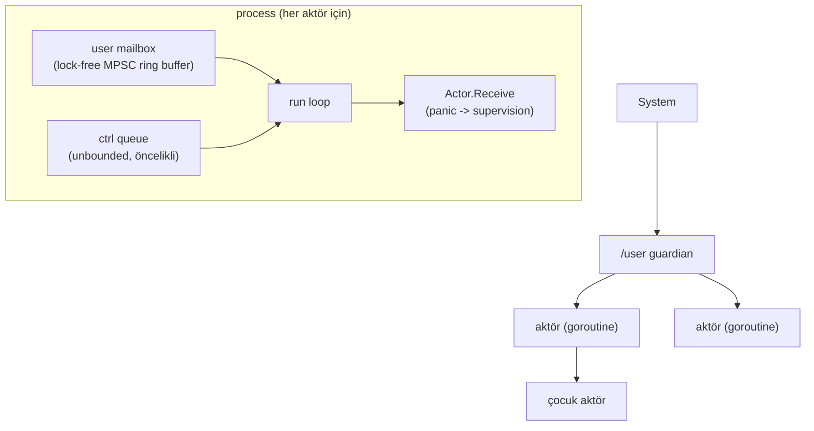

# Shardlands

2D top-down mini-MMO: kalıcı, shard'lanmış bir hub dünyası + talep üzerine
açılan gerçek zamanlı arena instance'ları. Amaç, dağıtık sistem
konseptlerini (konsensüs, event sourcing, sharding, actor model, CRDT,
observability...) üretim kalitesinde ama öğrenme odaklı bir projede uçtan
uca uygulamak.

## Monorepo Yapısı

```
pkg/actor/     Faz 0: sıfırdan actor framework (mailbox, supervision)  ✅
pkg/ringbuf/   Faz 0: lock-free MPSC ring buffer                       ✅
pkg/storage/   Faz 0: LSM-tree storage engine                          ✅
pkg/raft/      Faz 0: Raft konsensüs                                   ✅
pkg/clock/     Faz 0: Lamport / vector clock                           ✅
services/      Faz 1+: gateway, player, world, matchmaking             ⬜
operator/      Faz 5: arena instance Kubernetes operator'ü             ⬜
client/        HTML5 Canvas + vanilla JS istemci                       ⬜
```

## Faz 0 — Temel Yapı Taşları ✅ (tag: `faz0`)

| Bileşen | Durum | Notlar |
|---|---|---|
| Actor framework | ✅ | [pkg/actor](pkg/actor/README.md) — mailbox, supervision, restart stratejileri |
| Lock-free ring buffer | ✅ | [pkg/ringbuf](pkg/ringbuf/README.md) — Vyukov MPSC, mailbox'a entegre, kanaldan ~6× hızlı |
| LSM-tree storage engine | ✅ | [pkg/storage](pkg/storage/README.md) — skip list memtable, SSTable+bloom, WAL, manifest, compaction |
| Raft | ✅ | [pkg/raft](pkg/raft/README.md) — leader election + log replication, partition/chaos testleri |
| Logical clocks | ✅ | [pkg/clock](pkg/clock/README.md) — Lamport (atomic) + vector clock (nedensellik/eşzamanlılık) |

### Faz 0 kapanış — öne çıkan dersler

Ayrıntılar paket README'lerinde; kesitler:

1. **Sınır durumları tasarımın parçası.** Ring buffer'da cap-1 seq
   çakışması canlı deadlock olarak yakalandı; invariant yazıya dökülünce
   asgari kapasite kendiliğinden çıktı.
2. **Doğruluk çoğu kez sıralamada yaşıyor.** Aktör kapanışında
   dead→drain→close; LSM'de WAL→memtable, fsync→manifest; Raft'ta
   persist→cevap. Her biri "arada crash olursa?" sorusuyla test edildi.
3. **Flaky test hediyedir.** Üç gerçek hata (actor kapanış yarışı,
   cap-1, Windows delete-pending) önce test kararsızlığı olarak göründü.
4. **Bölünme birinci sınıf senaryodur.** Raft'ta partition, transport
   arayüzüne gömüldü; bütün ilginç davranışlar bölünmede yaşanıyor.
5. **Platform semantiği taşınabilir değil.** Windows'ta açık/yeni
   kapanmış dosya silme kısıtları iki gerçek düzeltme çıkardı
   (O_TRUNC'lı WAL reset, kapatmadan silmeme disiplini).

### Actor framework mimarisi



## Çalıştırma

```powershell
go test -race ./...
```
