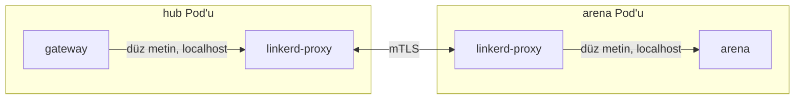

# Service Mesh, mTLS ve Zero Trust — Shardlands'te

Faz 6'nın üçüncü adımı. Bu not, koda geçmeden önce *ne yaptığımızı ve
neden* anlatır; kurulum ve doğrulama [deploy/README.md](../deploy/README.md)'de.

## 1. Problem: kesişen ilgiler her serviste tekrar yazılıyor

Faz 4'te devre kesici, bulkhead ve hız sınırlayıcıyı **kod içine** yazdık
(`pkg/resilience`, `pkg/ratelimit`). Bu bilinçliydi: mekanizmayı anlamak
için önce elle yazmak gerekir. Ama ölçek büyüdükçe aynı soruların her
serviste tekrar cevaplanması gerekir:

- Bu bağlantı şifreli mi?
- Karşı taraf gerçekten iddia ettiği servis mi?
- Bu çağrıyı yapmaya yetkili mi?
- Yeniden deneme, zaman aşımı, gecikme ölçümü?

Bunlar **uygulama mantığı değil**. Oyun sunucusunun bilmesi gereken şey
"kristal topla" ve "mermi hareket ettir"; TLS el sıkışması değil.

## 2. Sidecar pattern

Çözüm: bu işleri her Pod'a yerleştirilen ayrı bir proxy konteynerine
devretmek. Uygulama `localhost`'a konuşur; proxy şifreler, kimlik
doğrular, ölçer ve karşı tarafa gönderir.



Uygulama TEK BİR SATIR değişmeden şifreli ve kimlik doğrulamalı hale
gelir. `services/arena/server.go` hâlâ `grpc.NewServer()` diyor,
`arenalink.go` hâlâ `insecure.NewCredentials()` ile bağlanıyor — çünkü
**şifreleme uygulamanın işi olmaktan çıktı**.

Bedeli dürüstçe: her Pod'a fazladan bir konteyner, fazladan ~5-10ms
gecikme değil ama fazladan bellek/CPU ve — en önemlisi — **fazladan bir
hata kaynağı**. Ağ artık "çalışır ya da çalışmaz" değil; proxy'nin
yapılandırması da yanlış olabilir. §6'daki beş tuzak tam olarak bu.

### Data plane / control plane

- **Data plane**: her Pod'daki proxy'ler. Trafiği taşıyan katman.
- **Control plane**: proxy'lere "kim kimdir, kime izin var" diyen
  merkezî bileşenler (`linkerd-destination`, `linkerd-identity`,
  `linkerd-proxy-injector`).

Kontrol düzlemi çökerse veri düzlemi **çalışmaya devam eder** — proxy'ler
son bildikleri yapılandırmayla akar. Bu, kendi Raft'ımızda gördüğümüz
"liderlik kaybı = yazma durur ama okuma devam eder" ayrımının aynısı:
kontrol yolu ile veri yolunu ayırmak dayanıklılık üretir.

## 3. mTLS ve iş yükü kimliği

Sıradan TLS tek taraflıdır: istemci sunucuyu doğrular. **Mutual TLS**'te
iki taraf da sertifika sunar. Kritik soru şudur: sertifikayı kime, neye
dayanarak veriyoruz?

Linkerd'ün cevabı: **ServiceAccount**. Pod'un ServiceAccount token'ı
kube-apiserver tarafından imzalanmıştır; `linkerd-identity` bu token'ı
doğrular ve karşılığında şu biçimde bir kimlik taşıyan sertifika basar:

```
<serviceaccount>.<namespace>.serviceaccount.identity.linkerd.cluster.local
```

Yani `shardlands-server.shardlands.serviceaccount.identity.linkerd.cluster.local`.
Bu, SPIFFE'nin fikridir: **kimlik ağ konumundan (IP) değil, iş yükünün
kendisinden gelir**. IP değişir, Pod taşınır, düğüm ölür — kimlik kalır.

Buradaki kazanç Faz 3'teki fencing token tartışmasının kardeşi: orada
"kilidi hâlâ ben mi tutuyorum" sorusunu *korunan kaynakta* doğrulamıştık.
Burada "sen gerçekten hub musun" sorusunu *bağlantının kendisinde*
doğruluyoruz. İkisi de "söylediğine güvenme, kanıtı iste" ilkesi.

## 4. Zero trust: varsayılan reddet

Geleneksel güvenlik **perimeter** modelidir: dışarısı tehlikeli, içerisi
güvenli. Kümede bu model çöker — bir Pod ele geçerse "içerideki" her şeye
erişir. Bizim Faz 5'teki kaçak arena senaryosunu hatırla: kümede keyfi
Pod açabilen bir bileşen, kümenin tamamını açabilir.

Zero trust'ın üç ilkesi ve bizdeki karşılıkları:

| İlke | Shardlands'te |
| --- | --- |
| Ağ konumu güven üretmez | Aynı namespace'te olmak yetki vermez |
| Her istek doğrulanır | Her bağlantı mTLS ile kimliklenir |
| En az yetki | Her port için "kim çağırabilir" listesi |

Uygulaması: namespace'e `config.linkerd.io/default-inbound-policy: deny`.
Bundan sonra **hiçbir port hiç kimseye açık değildir**; açmak için açık
politika yazmak gerekir. Yanlışlıkla açık kalmış bir port kalmaz, çünkü
varsayılan "kapalı".

### Linkerd'ün politika kaynakları

- **`Server`**: "şu Pod'ların şu portu, şu protokolü konuşur". Politikanın
  hedefi.
- **`MeshTLSAuthentication`**: "şu kimlikler" (ServiceAccount listesi).
- **`NetworkAuthentication`**: "şu ağlar" (mesh dışı kaynaklar için —
  örneğin kubelet ya da ingress).
- **`AuthorizationPolicy`**: hedefi (`Server`) ve izin verileni
  (`*Authentication`) birbirine bağlar.

Ayrıştırmanın nedeni ilginç: "kim" ile "neye" ayrı kaynaklar olduğu için
aynı kimlik listesi birden çok Server'da yeniden kullanılabilir ve
politika denetimi (`kubectl get authorizationpolicy -A`) tek yerden okunur.

## 5. Bizim topolojide gerçek atlamalar hangileri?

Burada dürüst olmak gerekiyor. "gateway ↔ servis" demek, o atlamanın
**Pod sınırını geçtiğini** varsayar. Faz 6'ya girerken durum şuydu:

| Atlama | Gerçekte ne? |
| --- | --- |
| gateway → arena | **Pod sınırını geçiyor** (gRPC, uzak Pod IP'si) |
| gateway → NATS | **Pod sınırını geçiyor** (StatefulSet) |
| gateway → kube-apiserver | Küme dışı (Arena CRD yazımı) |
| gateway → player | `127.0.0.1:9101` — **aynı süreç içinde** |
| gateway → matchmaking | gRPC sunucusu var ama gateway `Matcher`'ı **doğrudan** çağırıyor |

Son iki satıra mesh politikası yazmak **tiyatro** olurdu: loopback
trafiğini proxy zaten yakalamaz, mTLS uygulanmaz, politika hiçbir şeyi
engellemez ama panoda yeşil görünür. Bu, öğrenme projesinde en zararlı
sonuçtur — çalıştığını sandığın bir güvenlik kontrolü.

Bu yüzden mesh adımının ilk işi **player servisini gerçekten ayırmak**
oldu: kendi Deployment'ı, kendi ServiceAccount'u, kendi Service'i. Artık
gateway → player bir ağ atlamasıdır ve politikanın engelleyecek bir şeyi
vardır. Strangler fig anlatısının bir dilimi daha kesildi ve bu sefer
sebebi güvenlik oldu.

Matchmaking bilerek bölünmedi: gateway onu gRPC ile değil, doğrudan
çağırıyor. Bölmek için önce çağrı yolunu değiştirmek gerekir — o ayrı bir
iş ve bu adımın konusu değil.

## 6. Beş gerçek tuzak

### (a) Kısa ömürlü iş yükü + sidecar = Pod hiç bitmez

Arena Pod'u `RestartPolicy: Never` ile koşar ve maç bitince süreç 0 ile
çıkar → Pod `Succeeded` → operator temizler. Faz 5'in tüm yaşam döngüsü
buna dayanıyor.

Sidecar eklendiğinde bu kırılır: **proxy hiç çıkmaz**. Uygulama biter,
proxy akmaya devam eder, Pod sonsuza kadar `Running` kalır. Operator
`Succeeded` göremez, TTL'e kadar bekler, sonra "ttl exceeded" der. Yani
mesh, doğru çalıştığı halde bizim yaşam döngümüzü bozar.

Klasik çözüm `linkerd-await --shutdown` sarmalayıcısıydı: uygulama
bitince proxy'nin kapanma uç noktasını çağır. Kubernetes 1.29'dan beri
daha temiz bir yol var: **native sidecar** — proxy, `restartPolicy:
Always` olan bir *init container* olarak koşar ve kubelet, ana konteyner
çıkınca onu kendisi durdurur. Linkerd'de açması:

```yaml
config.alpha.linkerd.io/proxy-enable-native-sidecar: "true"
```

Bu yüzden arena Pod'unun annotation'ları operator'ün `desiredPod`
fonksiyonuna gömüldü — Pod'u biz üretiyoruz, mesh'e uygun üretmek de
bizim işimiz.

### (b) NATS "önce sunucu konuşur" — protokol algılama takılır

Linkerd, portun protokolünü **ilk baytlara bakarak** algılar. HTTP'de
istemci önce konuşur, sorun yok. NATS'te ise bağlantı kurulur kurulmaz
**sunucu** `INFO {...}` yollar. Proxy istemciden bayt bekler, istemci
sunucudan bekler → algılama zaman aşımına düşer (~10sn) ve her NATS
bağlantısı on saniye gecikmeyle başlar.

Çözüm: portu **opak** ilan etmek — "burayı çözümlemeye çalışma, sadece
şifreli TCP olarak taşı":

```yaml
config.linkerd.io/opaque-ports: "4222"
```

mTLS yine uygulanır; kaybedilen şey yalnız protokol-farkında metrikler
(HTTP durum kodu gibi). Aynı tuzak MySQL, PostgreSQL, Redis (bazı
sürümlerde) ve SMTP için de geçerlidir.

### (c) `appProtocol` değeri — yanlış teşhisin anatomisi

Bu, ancak kümede koşturunca ortaya çıktı ve bu notun en öğretici parçası
olduğu için teşhis süreciyle birlikte yazıyorum.

Player Service'ine mesh'e protokolü söylemek için `appProtocol: grpc`
yazmıştım. Sonuç: hub → player çağrıları düştü.

Görünen belirtiler birbirini doğrular gibiydi ve hepsi yanlış yeri
işaret ediyordu:

| Nerede | Ne görünüyordu | Neyi düşündürüyordu |
| --- | --- | --- |
| Hub uygulaması | `error reading server preface: EOF` | TLS el sıkışması bozuk |
| Player proxy'si | `Connection denied ... server.name=player-grpc` | Yetkilendirme politikası yanlış |
| `linkerd diagnostics policy` | Doğru kimlik, "yetkili" | Politika doğru?! |

İlk hipotez "politika sırası" oldu: `deny` altında açılmış proxy'ler
kuralı geç öğreniyordur. Makul geliyordu ve bir kez de doğrulanmış gibi
oldu (bir Pod yeniden başlatıldıktan sonra çalıştı). **Yanlıştı.**
Politikalar iş yüklerinden önce uygulanarak küme sıfırdan kurulduğunda
arıza aynen tekrar etti.

Doğru neden tek değişkenli deneyle bulundu: `appProtocol` kaldırıldı →
çalıştı; `grpc` geri kondu → bozuldu; `kubernetes.io/h2c` yazıldı →
kalıcı olarak çalıştı.

Mekanizma: Linkerd yalnız Gateway API'nin **standart** `appProtocol`
değerlerini tanır. Tanımadığı bir değer gördüğünde bağlantıyı HTTP/1
sayar. gRPC istemcisi HTTP/2 preface yollar, karşılık gelmez, bağlantı
kapanır. İnbound tarafta ise `Server` gRPC beklerken HTTP/1 geldiği için
politika eşleşmesi düşer ve olay **"Connection denied"** diye loglanır —
yani bir *protokol* hatası, *yetkilendirme* hatası kılığında görünür.

Çıkarılacak ders teknikten çok yöntemsel: mesh, hata mesajlarının
katmanını kaydırır. Uygulama TLS hatası görür, proxy yetki hatası
loglar, gerçek sebep bir Service alanındaki string'dir. Bu yüzden
mesh'te teşhis, hipotezle değil **tek değişken değiştirerek** yapılır.

### (d) Politika sırası (yine de doğru alışkanlık)

Yukarıdaki arızanın sebebi olmadığı anlaşıldı ama `default-inbound-policy:
deny` altında iş yükünü kuralsız açmak gereksiz bir yarış penceresi
bırakır. `up.sh` bu yüzden namespace → politikalar → iş yükleri sırasını
izliyor; Faz 6'nın konteyner adımındaki CRD sırası tuzağıyla aynı biçim.

### (e) Enjektör hazır değilken açılan Pod sessizce meshsiz kalır

`linkerd-proxy-injector` webhook'u `failurePolicy: Ignore` ile kurulur.
Bu bilinçli bir tasarım — mesh çökerse küme çalışmaya devam etsin — ama
sonucu şu: webhook henüz hazır değilken açılan Pod'lar **proxy'siz**
açılır ve hiçbir yerde hata görünmez. Pod `Running`, uygulama çalışıyor,
her şey yeşil; yalnızca mTLS yok.

"Çalışıyor" ile "korunuyor" arasındaki farkı gösteren en iyi örnek bu.
Kontrol tek satır:

```bash
kubectl -n shardlands get pod X -o jsonpath='{.spec.initContainers[*].name}'
```

## 7. Ne ölçtük, ne kaybettik

Mesh bedava değil. Her atlamaya bir proxy hop'u ve TLS eklendi. Arena
tick döngüsünde 39.8ns'lik hassasiyetle uğraştığımız bir projede bunu
söylemeden geçmek yanlış olur — ama ölçek farkına dikkat: o 39.8ns
**süreç içi**, buradaki maliyet **ağ üstünde** ve zaten milisaniye
mertebesindeki bir yolun üstüne biniyor.

Ölçüm ve sayılar için [deploy/README.md](../deploy/README.md)'deki
doğrulama bölümüne bak.
