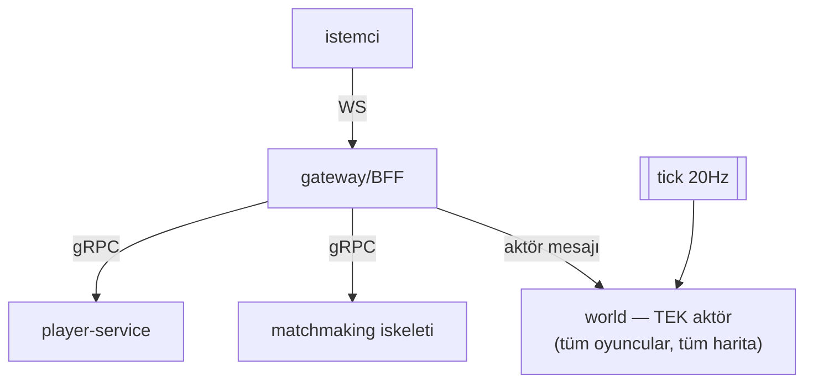
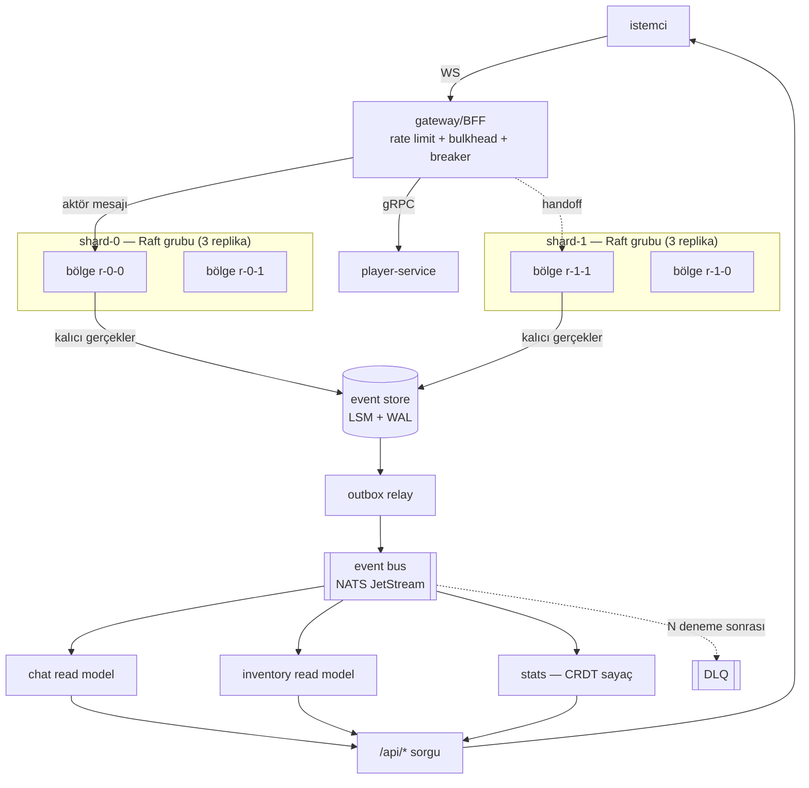

# Strangler Fig: Faz 1 Monolitinden Bugüne

Bu yazı, Shardlands'in Faz 1'deki tek parça prototipten bugünkü
sharding + event bus mimarisine nasıl geçtiğini, **hangi adımın neyi
mümkün kıldığını** anlatır.

## Desen: neden "boğan incir"?

Boğan incir, konak ağacın gövdesini sararak büyür; sonunda konak çürür
ve incir ayakta kalır. Yazılımda karşılığı: eskiyi bir gecede
değiştirmek yerine, **yeni yapıyı eskinin etrafında büyütmek** ve
işlevleri tek tek devretmek. Kritik özelliği: her adımda sistem
ÇALIŞIR durumda kalır — "büyük yeniden yazım" kumarına girilmez.

Shardlands'te bunu bilinçli uyguladık: Faz 1'de her şey tek süreçteydi
ama **gerçek sınırlarla** (ayrı TCP portları, gerçek gRPC). Böylece
sonraki fazlarda sınırları taşımak *kod değil topoloji* değişikliği
oldu.

## Önce: Faz 1 (tek node, doğrudan bağlantılar)

Özellikleri:
- Dünya tek aktör: tüm oyuncular tek goroutine'de. Basit, ama tek
  hata noktası ve tek ölçek noktası.
- Kalıcılık yok; durum bellekte.
- Servisler arası doğrudan çağrı; kimse aboneliğe dayanmıyor.

## Sonra: Faz 4 (shard'lı dünya + event bus + korumalar)

## Devir sırası ve her adımın kazandırdığı

| Faz | Devredilen | Kazanç | Bedel |
|---|---|---|---|
| 1 | — (monolit, gerçek sınırlarla) | Çalışan uçtan uca dilim | Ölçek/dayanıklılık yok |
| 2 | Durum → **event log** (CQRS/ES) | Kalıcılık, denetim izi, türetilebilir read model | Eventual consistency |
| 2 | Takas → **saga** | Kilitsiz, bloklamayan dağıtık işlem | İzolasyon yok, telafi yazma yükü |
| 2 | Global sayaç → **CRDT** | Lidersiz, bölünmede çalışan sayaç | Yalnız uygun (monoton) veriler |
| 3 | Dünya → **bölge shard'ları** | Ölçek + arıza yalıtımı (blast radius) | Handoff karmaşıklığı, bölgeler arası görüş yok |
| 3 | Shard sahipliği → **Raft** | Split-brain yok, failover | Çoğunluk yoksa bölge donar (CP) |
| 4 | Read model besleme → **event bus** | Üretici/tüketici ayrışması; süreç ayırmaya hazır | At-least-once → idempotentlik zorunlu |
| 4 | Yayın → **outbox relay** | Dual-write borcu kapandı | Yayın gecikmesi (relay kadar) |
| 4 | Dış çağrılar → **breaker + bulkhead** | Kaskad arıza kesildi | Ayar (eşik/cooldown) sorumluluğu |
| 4 | Giriş → **rate limit / shedding** | Kötüye kullanım + aşırı yük koruması | Meşru trafiği de kısabilir |

## Hangi "sarma" adımı neyi mümkün kıldı?

1. **Faz 1'de gerçek gRPC sınırları.** Tek süreçte bile ayrı portlar
   kullandık. Sonuç: Faz 6'da servisleri ayırmak için *çağrı kodunu*
   değiştirmek gerekmeyecek — yalnız adres.
2. **Faz 2'de event log'un tek doğruluk kaynağı olması.** Read
   model'ler türetilebilir hale geldi; Faz 4'te besleme kanalını
   (store → bus) değiştirmek read model'lerin *iç mantığını*
   etkilemedi: yalnız `es.Project` yerine `outbox.Consume` geldi.
3. **Faz 3'te bölge aktörleri.** Dünya zaten mesajla konuşuyordu
   (Faz 0 actor framework); bölgelere bölmek yeni bir iletişim modeli
   gerektirmedi — aynı mailbox semantiği, daha çok aktör.
4. **Faz 4'te outbox.** Faz 2'de dual-write borcunu *not ettik* ve
   kapatmayı ertelemedik-unutmadık; bus geldiğinde doğru çözüm
   hazırdı.

## Kalan konak dallar (bilinçli borç)

- Her şey hâlâ **tek süreçte** koşuyor (gömülü NATS, in-process Raft
  grupları). Faz 6'da süreçler/pod'lar ayrılacak; sınırlar zaten yerinde.
- **Bölgeler arası görüş (border AOI)** yok: sınırın öte yanındaki
  oyuncuyu görmüyorsun.
- Read model'ler **in-memory**; her açılışta akış baştan oynanıyor.
  Büyük log'da snapshot'lama gerekecek.
- Matchmaking hâlâ iskelet (Faz 5).

## Ders

**Strangler fig bir teknik değil, bir sıralama disiplinidir.** Her fazda
"çalışan sistem" korunur ve bir sonraki adımı mümkün kılan sınır önceden
çizilir. Bu projede en çok işe yarayan üç sınır: (1) gerçek ağ
çağrıları, (2) event log'un tek doğruluk kaynağı olması, (3) aktör
mesajlaşması. Üçü de "şimdilik gereksiz" görünürken konulmuştu; her biri
sonraki fazın maliyetini düşürdü.
